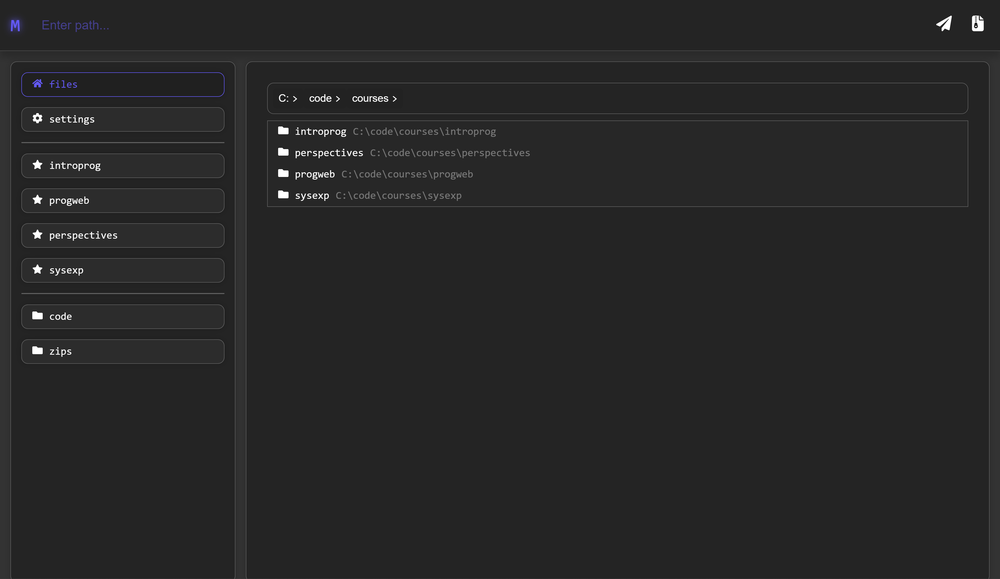
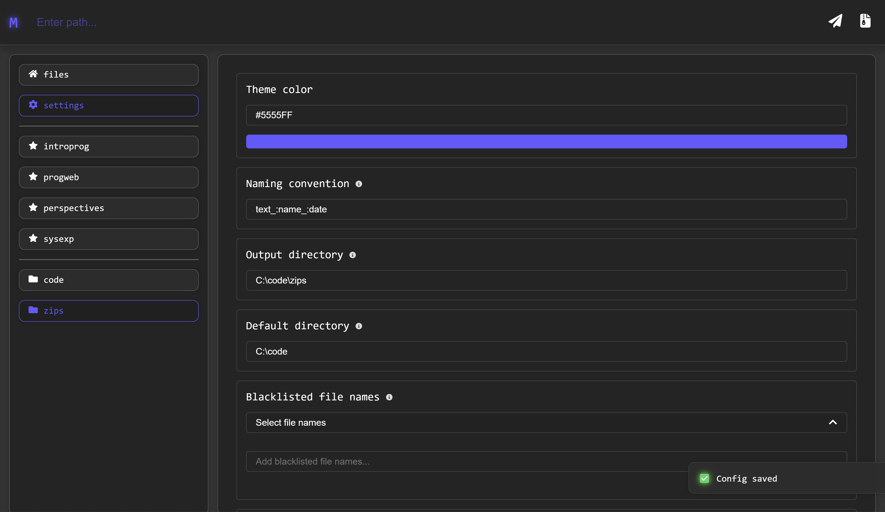

# Mia Software (GUI)

## Details

Mia is a software that allows you to create zip files from a simple and intuitive interface. It is based on two 
previous versions:
- [Mia (Rust)](https://github.com/Azuyamat/mia_rust) v2 - Mia CLI (Command-line interface) made in Rust
- [Mia (Python)](https://github.com/Azuyamat/mia) v1 - Mia Python script

The software is made to ease the creation of zip files for submission to scholar projects. It's key features are 
file, folder and extension blacklisting during zip creation. This allows you to create a zip without the `/bin`, 
`/obj`, `.git` and other folders, files and extensions that are not needed for the submission.

## Installation

The installation is very simple, just download the latest release from the 
[releases page](https://github.com/Azuyamat/mia_gui/releases/latest). Make sure to choose the correct version for 
your **OS**. For example, if you are on Windows, download the `mia_<version>_<arch>_<lang>.msi ` file or the `.exe` 
or the `.zip` accordingly.

Once installed, execute the file. You may be prompted with a warning from Windows, just click on `More info` and 
then `Run anyway`. This is because the software is not signed with a certificate and Windows does not recognize it. 
If you want to be sure that the software is safe, you can check the source code and compile it yourself.

## Usage

### Zipping
The usage is very simple. Just input the folder you would like to navigate to in the navigation bar. Once done, you 
will be given a view of the folders and files in that directory. You can either **right-click** on a file or folder 
to access the context actions and zip from there or simply click the zip icon on the top right of the window.

### Settings
Most settings are pretty self-explanatory, just input the value you and **save the config**. Here are some details:

#### Theme color
The theme color is the color of the top bar and the icons. You can choose any valid color format. For example, 
`#FFBB33`, `red`, `rgb(255, 0, 0)` and so on.
#### Naming
The naming is the name of the zip file. You can use the following variables:
- `:name` - The name of the folder you are zipping
- `:date` - The current date in the format `yyyy-mm-dd`
- Got any suggestions? Let me know!
#### Output directory
The output directory is the directory where the zip file will be saved. If none is given, the zip file will be saved 
under the working folder.
#### Default directory
The default directory is the directory that will be opened when the software is launched.
#### Blacklist
The blacklist is a list of files, folders and extensions that will be ignored when zipping. For example, if you add 
`bin` to the folder blacklist, the `/bin` folder will be ignored when zipping. The same goes for files and extensions.
#### Favorite directories
The favorite directories are the directories that will be shown in the sidebar. You can add as many as you want and 
re-order them with ease by using the arrows while hovering over an entry.
#### IDEs
To add an IDE to the settings values, you need to add the name of the IDE (this can be anything you want). Then, get 
the executable path for the IDE. For example, most Jetbrains products are in the Program Files and can be easily found.
Once you add an IDE to the settings, they will appear in the context actions where you can easily launch your products.

## Updating
The software will automatically check for updates whenever the settings are opened. If an update is needed, you will 
be able to see it at the very bottom of the settings panel. This is also where you will find your current version 
along with your current `tauri` version, which is the framework used to build the software.

## Images

## Contributing
If you want to contribute to the project, you can do so by opening a pull request.

## License
This software is licensed under the MIT license. You can find the license in the `LICENSE` file in the root of the 
project.